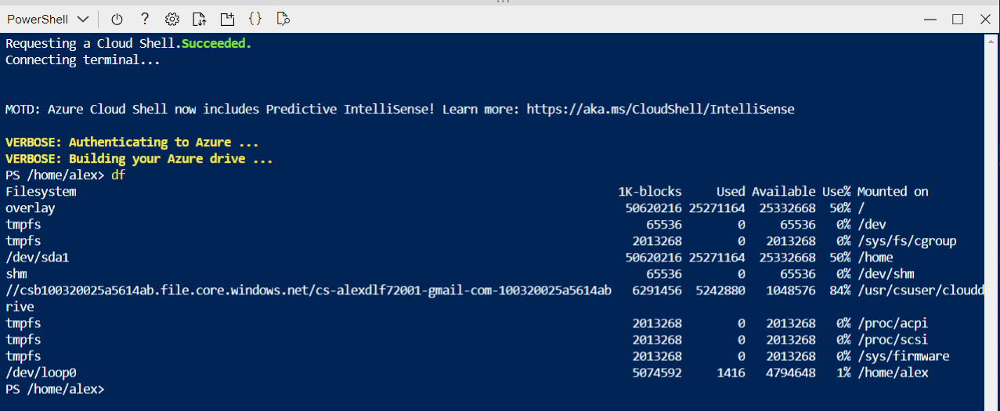
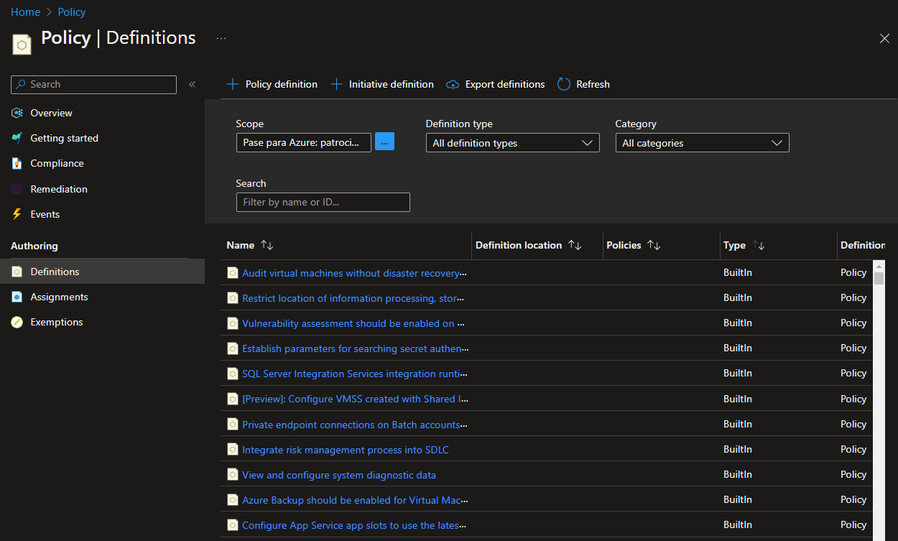

# Lab 02b - Manage Governance via Azure Policy

*17 de Enero de 2023*

## Objetivos

- **Task 1**: Crear y asignar etiquetas a través de Azure.
- **Task 2**: Hacer cumplir el etiquetado a través de una política de Azure.
- **Task 3**: Aplicar el etiquetado a través de una política de Azure.

## Diagrama de arquitectura

## Instrucciones

### TASK 1: Crear y asignar etiquetas a través de Azure.

1. En Azure Portal, iniciamos una sesión de **PowerShell dentro de** **Cloud Shell** .

2. En el panel de Cloud Shell, ejecutamos lo siguiente para identificar el nombre de la cuenta de almacenamiento que usa Cloud Shell:

   `df`

3. En el resultado del comando, tenemos en cuenta la primera parte de la ruta que designa el montaje de la unidad principal de Cloud Shell (marcada aquí como `xxxxxxxxxxxxxx`:

   `//xxxxxxxxxxxxxx.file.core.windows.net/cloudshell   (..)  /usr/csuser/clouddrive`

En nuestro caso lo que nos interesa es el siguiente nombre: **csb100320025a5614ab**.

4. Buscamos y seleccionamos **Storage accounts** y hacemos click en la cuenta de almacenamiento con el nombre que vimos anteriormente.

5. En la hoja de la cuenta de almacenamiento, hacemos clic en el vínculo que representa el nombre del **grupo de recursos** que contiene la cuenta de almacenamiento.

6. Dentro de la pagina de nuestro grupo de recursos en **Overview** le damos a **Edit** o **Click here to add tags** que nos saldrá al lado de **Tags**.

   

6. Añadimos el Tag con los siguientes datos:

   | Setting | Value     |
   | :------ | :-------- |
   | Name    | **Role**  |
   | Value   | **Infra** |

7. Volveremos a la hoja de la cuenta de almacenamiento. Revisaremos la información de **Overview** y tenemos que tener en cuenta que la nueva etiqueta no se asignó automáticamente a la cuenta de almacenamiento.

   

### TASK 2: Hacer cumplir el etiquetado a través de una política de Azure.

1. En Azure Portal, buscamos y seleccionamos **Policy**.

2. En la sección **Authoring**, hacemos clic en **Definitions**. Enumeramos todas las políticas integradas que implican el uso de etiquetas seleccionando la entrada **Tags** (y anulando la selección de todas las demás entradas) en la lista desplegable **Category**.

   

3. Buscamos y hacemos click en **Require a tag and its value on resources** y le damos a **Assign**.

   

4. Seleccionamos los siguientes valores:

   | Setting        | Value                                                        |
   | :------------- | :----------------------------------------------------------- |
   | Subscription   | the name of the Azure subscription you are using in this lab |
   | Resource Group | the name of the resource group containing the Cloud Shell account you identified in the previous task |

   

5. Configuramos la pestaña **Basics** de la tarea especificando los siguientes ajustes (deje los demás con sus valores predeterminados):

   | Setting            | Value                                                        |
   | :----------------- | :----------------------------------------------------------- |
   | Assignment name    | **Require Role tag with Infra value**                        |
   | Description        | **Require Role tag with Infra value for all resources in the Cloud Shell resource group** |
   | Policy enforcement | Enabled                                                      |

6. Hacemos clic en **Next** y establecemos los **Parameters** en los siguientes valores:

   | Setting   | Value     |
   | :-------- | :-------- |
   | Tag Name  | **Role**  |
   | Tag Value | **Infra** |

7. Hacemos click en **Next** y revisamos la pestaña **Remediation**. Dejamos la casilla de **Create a Managed Identity** sin marcar.
8. Hacemos click en **Review + Create** y luego hacemos clic en **Create**.

9. Volvemos al grupo de recursos donde se aloja nuestra cuenta de almacenamiento y hacemos click en **+ Create** y luego buscamos **Storage Account** y hacemos click en **+ Create**.

10. En la pestaña **Basics**, verificamos que esté utilizando el grupo de recursos al que se aplicó la política y especificamos la siguiente configuración (deje los demás con sus valores predeterminados), haga click en **Review + create** y luego hacemos clic en **Create** :

    | Setting              | Value                                                        |
    | :------------------- | :----------------------------------------------------------- |
    | Storage account name | any globally unique combination of between 3 and 24 lower case letters and digits, starting with a letter |

11. Una vez que cree la implementación, debería ver el mensaje de Error de implementación. Tendremos que verificar que el mensaje de error indica que la política no permite la implementación de recursos.

    

### TASK 3: Aplicar el etiquetado a través de una política de Azure.

1. En Azure Portal, buscamos y seleccionamos **Policy**.

2. En la sección **Authoring**, hacemos clic en **Assignments** .

3. En la lista de asignaciones, hacemos clic en el icono de puntos suspensivos en la fila que pone **Require Role tag with Infra value** clicamos en **Delete assignment**.

4. Hacemos clic en **Assign policy** y seleccionamos los siguientes valores:

   | Setting        | Value                                                        |
   | :------------- | :----------------------------------------------------------- |
   | Subscription   | the name of the Azure subscription you are using in this lab |
   | Resource Group | the name of the resource group containing the Cloud Shell account you identified in the first task |

5. Para especificar la **definición de política** , haga clic en el botón de puntos suspensivos y luego busque y seleccione **Inherit a tag from the resource group if missing** y le damos a **Add**.

   

6. Lo demás lo configuraremos con los siguientes datos:

   | Setting            | Value                                                        |
   | :----------------- | :----------------------------------------------------------- |
   | Assignment name    | **Inherit the Role tag and its Infra value from the Cloud Shell resource group if missing** |
   | Description        | **Inherit the Role tag and its Infra value from the Cloud Shell resource group if missing** |
   | Policy enforcement | Enabled                                                      |

7. Hacemos clic en **Next**  y establecemos los **Parameters**  en los siguientes valores:

   | Setting  | Value    |
   | :------- | :------- |
   | Tag Name | **Role** |

8. Hacemos clic en **Next** y, en la pestaña **Remediation**, configuramos los siguientes ajustes (deje los demás con sus valores predeterminados):

   | Setting                   | Value                                                |
   | :------------------------ | :--------------------------------------------------- |
   | Create a remediation task | enabled                                              |
   | Policy to remediate       | **Inherit a tag from the resource group if missing** |

9. Hacemos click en **Review + Create** y luego hacemos click en **Create**.

10. Volvemos a la hoja del grupo de recursos que aloja la cuenta de almacenamiento utilizada para la unidad principal de Cloud Shell, que identificamos en la primera tarea.

11. En la hoja del grupo de recursos, hacemos clic en **+ Create** y luego buscamos **Storage Account** y hacemos clic en **+ Create**.

12. En la pestaña **Basics** de **Create storage account**, verificamos que estamos usando el grupo de recursos al que se aplicó la política y especificamos la siguiente configuración (deje los demás con sus valores predeterminados) y hacemos clic en **Review + create** :

    | Setting              | Value                                                        |
    | :------------------- | :----------------------------------------------------------- |
    | Storage account name | any globally unique combination of between 3 and 24 lower case letters and digits, starting with a letter |

13. Verificamos que esta vez haya pasado la validación y hacemos clic en **Create** .

14. Una vez que se aprovisiona la nueva cuenta de almacenamiento, hacemos clic en el **Go to resource** y, en **Overview** de la cuenta de almacenamiento recién creada, observamos que la etiqueta **Role** con el valor **Infra** se ha asignado automáticamente al recurso.

    